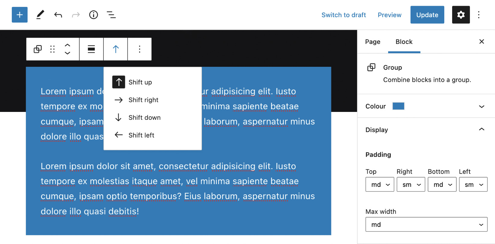

# Core Style

A little plugin that extends core WordPress blocks with the following options.

## Options
- Shift: Choose to shift the current block up, right, down or left.
- Padding: Choose from preset padding options for visual consistency.
- Max Width: For when you want to limit a block to a preset width.

## Usage
To override the shift, padding and max-width values just set your own values for the corresponding CSS variables.

```css
body {
    --cs-shift-up: -5rem;
    --cs-shift-right: -2.5rem;
    --cs-shift-down: -5rem;
    --cs-shift-left: -2.5rem;
    --cs-max-width-sm: 30rem;
    --cs-max-width-md: 40rem;
    --cs-max-width-lg: 50rem;
    --cs-padding-sm: 1rem;
    --cs-padding-md: 2.5rem;
    --cs-padding-lg: 5rem;
}
```

### Admin

