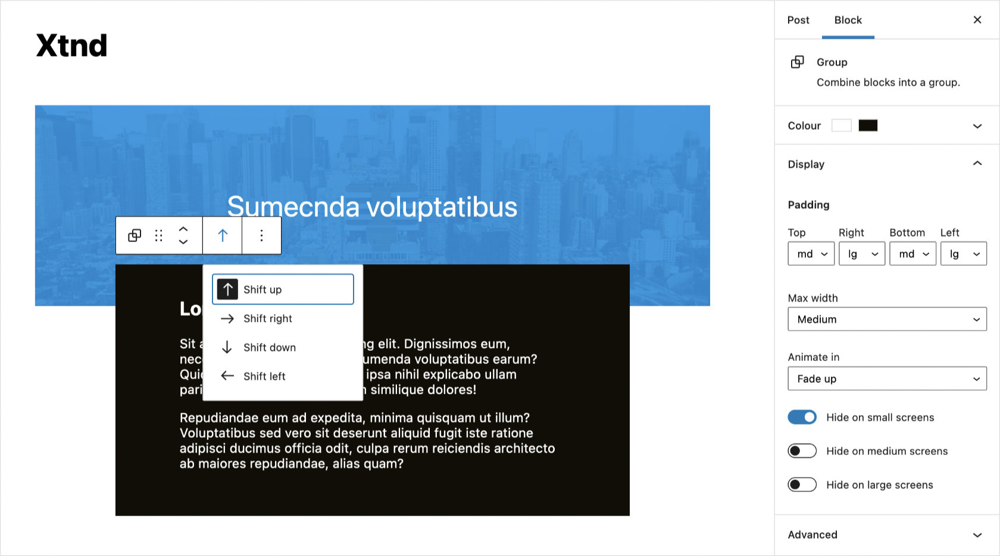

# Xtnd

A little plugin that extends WordPress blocks with a few extra display options.

## Options
- Shift: Choose to shift the block up, right, down or left.
- Padding: Add padding to any and all sides of a block.
- Max width: Limit the block to maximum width.
- Animate in: Fade in a block when it's scrolled into view.
- Visibility: Hide blocks for certain screen sizes.

## Usage
You can override the shift, padding and max-width values as well as tweak the animations using the following CSS custom properties.

```css
body {
	--x-shift-up: -5rem;
	--x-shift-right: -2.5rem;
	--x-shift-down: -5rem;
	--x-shift-left: -2.5rem;
	--x-padding-sm: 1rem;
	--x-padding-md: 2.5rem;
	--x-padding-lg: 5rem;
	--x-max-width-sm: 30rem;
	--x-max-width-md: 40rem;
	--x-max-width-lg: 50rem;
	--x-animation-duration: 1s;
	--x-animation-distance: 1rem;
	--x-animation-easing: cubic-bezier(0.46, 0.03, 0.52, 0.96);
}
```
### Admin

